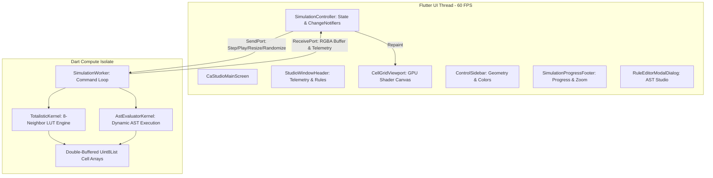

# cell_automata

## Keyboard Shortcuts

| Shortcut | Action |
| :--- | :--- |
| <kbd>Space</kbd> | Toggle Play / Pause |
| <kbd>→</kbd> (Right Arrow) | Single Step Forward |
| <kbd>←</kbd> (Left Arrow) | Single Step Backward |
| <kbd>Ctrl</kbd> + <kbd>R</kbd> | Randomize Grid (18% density) |
| <kbd>Middle-Click Drag</kbd> | Pan Canvas |
| <kbd>Right-Click Drag</kbd> | Pan Canvas |
| <kbd>Space</kbd> + <kbd>Left-Click Drag</kbd> | Pan Canvas |
| <kbd>Scroll Wheel</kbd> | Zoom In / Out |

---

## Architecture Overview



- **Clean Decoupling**: Simulation physics and cell array transitions run entirely off the UI thread inside `SimulationWorker`.
- **Double-Buffering**: Cell grids utilize double-buffered memory arrays with wrap-around toroidal boundaries.
- **LUT Acceleration**: Classical totalistic rules execute via integer bitmask lookup tables for maximum neighbor processing throughput.

---

## Getting Started

### Prerequisites
- **Flutter SDK**: `>= 3.13.2`
- **Dart SDK**: `>= 3.0.0`
- **Linux Toolchain**:
  ```bash
  sudo apt-get update
  sudo apt-get install -y clang cmake ninja-build pkg-config libgtk-3-dev
  ```

### Installation

1. **Clone the repository**:
   ```bash
   git clone https://github.com/your-username/cellautomata.git
   cd cellautomata/CellAutomata
   ```

2. **Install Flutter dependencies**:
   ```bash
   flutter pub get
   ```

3. **Run the desktop app**:
   ```bash
   flutter run -d linux
   ```

4. **Build a standalone Linux release bundle**:
   ```bash
   flutter build linux --release
   ```
   The compiled binary will be located in `build/linux/x64/release/bundle/cell_automata`.

---

## Verification & Testing

The project includes an automated test suite verifying kernel transition dynamics, AST expression parsing, and UI widget ergonomics:

```bash
# Run unit and widget tests
flutter test

# Run static analysis
flutter analyze
```

---

## Project Structure

```
CellAutomata/
├── assets/
│   ├── rules/                 # Built-in rule definitions & schemas
│   └── shaders/
│       └── cell_grid.frag     # GPU fragment shader for high-speed cell rendering
├── lib/
│   ├── controllers/           # SimulationController & telemetry state
│   ├── isolates/              # SimulationWorker background isolate engine
│   ├── kernels/               # TotalisticKernel & AstEvaluatorKernel
│   ├── models/                # PresetRule, CellShape, AST definitions
│   ├── rule_editor/           # Lexer, parser, syntax highlight & editor widgets
│   ├── theme/                 # Dark studio theme & design system tokens
│   └── ui/
│       ├── dialogs/           # Rule Editor modal dialog
│       ├── header/            # Window header, rule breadcrumbs & telemetry
│       ├── screens/           # CaStudioMainScreen scaffold
│       ├── sidebar/           # Geometry, colors, and simulation controls
│       └── viewport/          # Cell grid canvas, progress timeline, zoom footer
└── test/                      # Kernel tests, syntax tests, widget smoke tests
```

---

## License

This project is open source and available under the [MIT License](LICENSE).
