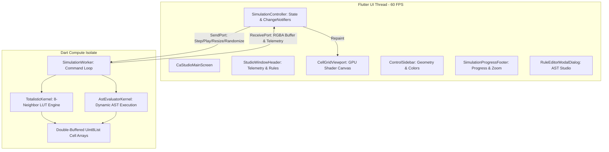

[README.md](https://github.com/user-attachments/files/31880730/README.md)
# CA Studio (Cell Automata)

[](https://flutter.dev)
[](https://dart.dev)
[](https://flutter.dev/desktop)
[](LICENSE)
[]()

A high-performance, GPU-accelerated Cellular Automata simulation workstation and rule development studio built with Flutter for Linux desktop.

Designed for fluid real-time experimentation with classical totalistic rules, arbitrary grid dimensions, custom AST-based rule scripting, and isolate-backed multi-threaded compute.

---

## Key Features

### 🚀 High-Performance Simulation Engine
- **Dedicated Background Compute Isolate**: Grid state simulation executes on a separate Dart isolate (`SimulationWorker`), preventing UI jank and maintaining a rock-solid 60 FPS interface even on massive grids.
- **Hardware-Accelerated Fragment Shader**: GPU rendering pipeline powered by a custom GLSL fragment shader (`cell_grid.frag`) with fallback to optimized Canvas buffer rendering.
- **Strict 1:1 Cell Aspect Ratio**: Guaranteed square cell geometry with symmetrical centering, pillarboxing/letterboxing margins, and dynamic viewport fitting.
- **High-Throughput Raw Frame Streaming**: Seamless zero-copy byte buffer transfers between worker isolates and the UI thread.

### 🔬 Rules Engine & Interactive AST Rule Editor
- **Classical Totalistic Rules Built-In**:
  - **Conway's Life** (`B3/S23`) — The definitive standard.
  - **HighLife** (`B36/S23`) — Features the famous Replicator oscillator.
  - **Seeds** (`B2/S`) — Explosive growth patterns from minimal seeds.
  - **Life without Death** (`B3/S012345678`) — Ink-spread maze generation.
  - **34 Life** (`B34/S34`) — Dense oscillator and glider formations.
  - **Diamoeba** (`B35678/S5678`) — Organic diamond-shaped cell colony growth.
  - **2x2** (`B36/S125`) — Macro-block and pattern symmetries.
  - **Day & Night** (`B3678/S34678`) — Symmetric behavior in on/off cell inversion.
  - **Morley / Move** (`B368/S245`) — Glider-dense, lively particle dynamics.
  - **Anneal** (`B4678/S35678`) — Majority voting and grain-boundary dynamics.
- **Custom Rule Editor Dialog**:
  - Embedded AST lexer and recursive-descent parser.
  - Interactive syntax expression editing with live error checking and diagnostic highlights.
  - Function token quick-palette with hover documentation cards.
  - Live compilation and hot-swapping into the running simulation.

### 🎨 Viewport Navigation & Canvas Ergonomics
- **Fluid Panning**: Navigate grids of any size using **Middle-Click Drag**, **Right-Click Drag**, **Spacebar + Left-Click Drag**, or dragging outside grid margins with dynamic grab cursor feedback.
- **Smooth Step Zoom**: Increment/decrement zoom with dedicated `[-] % [+]` controls or mouse scroll wheel.
- **Interactive In-Grid Cell Editing**: Draw live cells or toggle cell erasure with mouse primary clicks in real time.
- **Custom Visual Styling**:
  - Selectable cell geometry: Square or Rounded cells.
  - Adjustable inter-cell padding.
  - Live cell alive color palette (Emerald, Deep Purple, Amber, Cyan, Rose) with custom color picker integration.

### ⏱️ Timeline & Telemetry Controls
- **Playback Strip**: Play/Pause toggle, single-step forward, single-step backward, rewind to Generation 0.
- **Simulation Speed**: Adjustable step interval (ms) for fine-grained pacing.
- **Generation Limits**: Run with configurable generation ceilings (e.g., 500, 1000 max) or unlimited ($\infty$) simulation mode with a synchronized progress timeline.
- **Population Density & FPS Counters**: Real-time FPS telemetry, live cell population tally, and population density percentage display.
- **Jitter-Free Typography**: Fixed-width badges ensuring telemetry numbers update smoothly without panel jumping.

---

## Keyboard Shortcuts

| Shortcut | Action |
| :--- | :--- |
| <kbd>Space</kbd> | Toggle Play / Pause |
| <kbd>→</kbd> (Right Arrow) | Single Step Forward |
| <kbd>←</kbd> (Left Arrow) | Single Step Backward |
| <kbd>Ctrl</kbd> + <kbd>R</kbd> | Randomize Grid (18% density) |
| <kbd>Middle-Click Drag</kbd> | Pan Canvas |
| <kbd>Right-Click Drag</kbd> | Pan Canvas |
| <kbd>Space</kbd> + <kbd>Left-Click Drag</kbd> | Pan Canvas |
| <kbd>Scroll Wheel</kbd> | Zoom In / Out |

---

## Architecture Overview



- **Clean Decoupling**: Simulation physics and cell array transitions run entirely off the UI thread inside `SimulationWorker`.
- **Double-Buffering**: Cell grids utilize double-buffered memory arrays with wrap-around toroidal boundaries.
- **LUT Acceleration**: Classical totalistic rules execute via integer bitmask lookup tables for maximum neighbor processing throughput.

---

## Getting Started

### Prerequisites
- **Flutter SDK**: `>= 3.13.2`
- **Dart SDK**: `>= 3.0.0`
- **Linux Toolchain**:
  ```bash
  sudo apt-get update
  sudo apt-get install -y clang cmake ninja-build pkg-config libgtk-3-dev
  ```

### Installation

1. **Clone the repository**:
   ```bash
   git clone https://github.com/your-username/cellautomata.git
   cd cellautomata/CellAutomata
   ```

2. **Install Flutter dependencies**:
   ```bash
   flutter pub get
   ```

3. **Run the desktop app**:
   ```bash
   flutter run -d linux
   ```

4. **Build a standalone Linux release bundle**:
   ```bash
   flutter build linux --release
   ```
   The compiled binary will be located in `build/linux/x64/release/bundle/cell_automata`.

---

## Verification & Testing

The project includes an automated test suite verifying kernel transition dynamics, AST expression parsing, and UI widget ergonomics:

```bash
# Run unit and widget tests
flutter test

# Run static analysis
flutter analyze
```

---

## Project Structure

```
CellAutomata/
├── assets/
│   ├── rules/                 # Built-in rule definitions & schemas
│   └── shaders/
│       └── cell_grid.frag     # GPU fragment shader for high-speed cell rendering
├── lib/
│   ├── controllers/           # SimulationController & telemetry state
│   ├── isolates/              # SimulationWorker background isolate engine
│   ├── kernels/               # TotalisticKernel & AstEvaluatorKernel
│   ├── models/                # PresetRule, CellShape, AST definitions
│   ├── rule_editor/           # Lexer, parser, syntax highlight & editor widgets
│   ├── theme/                 # Dark studio theme & design system tokens
│   └── ui/
│       ├── dialogs/           # Rule Editor modal dialog
│       ├── header/            # Window header, rule breadcrumbs & telemetry
│       ├── screens/           # CaStudioMainScreen scaffold
│       ├── sidebar/           # Geometry, colors, and simulation controls
│       └── viewport/          # Cell grid canvas, progress timeline, zoom footer
└── test/                      # Kernel tests, syntax tests, widget smoke tests
```

---

## License

This project is open source and available under the [MIT License](LICENSE).
